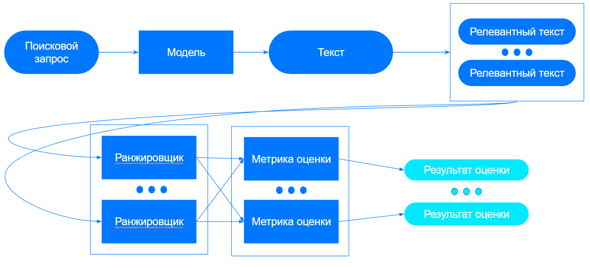

# Описание используемых метрик


Основная задача проекта - генерация высоко релевантных, по мнению ранжировщика, 
документов, соответствующих запросу пользователя. В связи с этим возникла необходимость
оценивать релевантность текста относительно запроса и позицию сгенерированного текста среди других. 

**С помощью данных метрик мы апроксимировали и моделировали отсутствующий ранжировщик от заказчика.**

Были использованы следующие метрики и алгоритмы ранжирования:

* Модели ранжирования: **[LaBSE](https://huggingface.co/sentence-transformers/LaBSE)**, **[USE](https://huggingface.co/vprelovac/universal-sentence-encoder-multilingual-large-3)**. 
Представляющие из себя модели для кодирования текстов в векторное представление, 
что позволяет оценивать похожесть двух документов через косинусное расстояние между их векторами. 
  
* Алгоритм ранжирования **[BM25](https://pypi.org/project/rank-bm25/)**, который оценивает число ключевых слов из запроса в каждом документе и на основании этого строит оценку похожести

С на основании оценки вышеперечисленных ранжировщиков производился подсчет следующих метрик:
* Top@K - как часто сгенерированный документ занимает топ k. Были выбраны вариации топ 1, 3, 5
* AverageLoc - средняя позиция документа в выдаче
* FDARO - как часто сгенерированный документ находится выше всех релевантных документов


# Пайплайн оценки

Рассмотрим пайплайн оценки. Для каждого запроса генерировался документ, который смешивался с релевантными документ для 
данного запроса, далее для каждого документа, внутри ранжировщика, оценивалось расстояние с запросом, полученные оценки
похожести сортировались в зависимости от метрики схожести, используемой в модели ранжирования. 
Далее на полученных оценках похожести производился подсчет метрик оценки и выводился результат оценки.

Схема пайплайна оценки:



Пример вывода подсчитанных метрик:
```
{
    'LaBSE_AverageLoc': 10.5, 
    'Bm25_AverageLoc': 1.13513, 
    'LaBSE_Top@1': 0.0, 
    'LaBSE_Top@3': 0.013513, 
    'LaBSE_Top@5': 0.013513, 
    'Bm25_Top@1': 0.91891, 
    'Bm25_Top@3': 1.0, 
    'Bm25_Top@5': 1.0, 
    'LaBSE_FDARO': 0.6216, 
    'Bm25_FDARO': 1.0
}
```

Или более красивый (Автор Искорнеев Матвей)
```
LaBSE_AverageLoc: 4.5   Bm25_AverageLoc: 3.0   
-----------------------------
LaBSE_AverageRelLoc: 0.75   Bm25_AverageRelLoc: 0.5   
-----------------------------
LaBSE_Top@1: 0.0   Bm25_Top@1: 0.5   
LaBSE_Top@3: 0.5   Bm25_Top@3: 0.5   
LaBSE_Top@5: 0.5   Bm25_Top@5: 1.0   
-----------------------------
LaBSE_FDARO@v1: 0.5   Bm25_FDARO@v1: 0.5   
LaBSE_FDARO@v2: 0.5   Bm25_FDARO@v2: 0.5   
-----------------------------
LaBSE_UpQuartile: 0.5   Bm25_UpQuartile: 0.5 
```

# Итог

В результате написанные метрики были оформлены в отдельный пакет и загружены на PYPI. [Ссылочка на пакет](https://pypi.org/project/docs-ranking-metrics/)
Пакет получился универсальный и легко расширяемый что позволяет его использовать для подобного рода задач.

Хотите принять участи в разработке или посмотреть код? Милости просим [тык](https://github.com/betepok506/RankingMetrics/tree/main)!