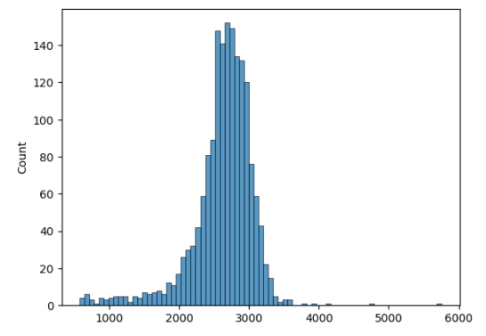

# Описать обучения модели ruGPT3 и эксперименты на новых данных и ранжировщике

В качестве стартовой точки была выбрана модель [ai-forever/rugpt3large_based_on_gpt2](https://huggingface.co/ai-forever/rugpt3large_based_on_gpt2) от Сбера, 
предварительно обученная с помощью [CLM](https://d4mucfpksywv.cloudfront.net/better-language-models/language_models_are_unsupervised_multitask_learners.pdf)

Дообучение производилось на данных заказчика.

Конфиг обучения:
```commandline
# Logging metrics
basic:
  wandb_project: "MadeFakeDocs"

# Model
model:
  model_name: "ai-forever/rugpt3large_based_on_gpt2"
  tokenizer_name: "ai-forever/rugpt3large_based_on_gpt2"
  local_path: './result_gpt3_new_data_train'
  use_local: False
  path_save_model: str
  input_max_length: 256
  target_max_length: 1024
  total_samples: 2000
  type_of_training: "clm"


# Dataset
dataset:
  save_dir: 'data'
  dataset_name: "made_data"
  block_size: 256
  mlm: False
  path_to_save_txt: "./data/gpt_training/txt_training.txt"
  name_txt_file: "txt_training.txt"


# TrainingArguments
train_params:
  pre_trained: bool
  output_dir: <YOUR PATH>
  overwrite_output_dir: True
  num_train_epochs: 10  # number of training epochs
  per_device_train_batch_size: 1  # batch size for training
  per_device_eval_batch_size: 1  # batch size for evaluation
  warmup_steps: 10  # number of warmup steps for learning rate scheduler
  gradient_accumulation_steps: 16   # to make "virtual" batch size larger

  # Optimizer
  lr: 1e-5

```

# Обучение на данных, отобранных с сайта "[Как Просто](prepare_data.md)"

Сайт содержит ответы на разные вопросы пользователей, он был выбран из-за простоты парсинга и отчистки текстов от разметки сайта.
Но как выяснилось - сайт очень часто содержит кулинарные рецепты, что несколько смещает область.

Для проверки качества генерации модели использовалась модель [perplexity](https://github.com/facebookresearch/cc_net)
Проверка осуществлялась на валидационном наборе данных, которые модель не видела. 

Произведем оценку сгенерированных текстов на ранжировщиках заказчика:

* Медианная позиция: 27 
* Средневзвешенная позиция: 24.66 
* Медианная позиция в процентах: 83.33% 
* Перплексия составила 7%

Из оценок видно, что текста оценили хуже чем рандомные, хотя текста хорошие. 


Распределение длин сгенерированных текстов: 




...

## Perplexity

Рассмотрим подробнее плохие текста по мнению модели Perplexity:

Текст 1:
```
200 мл бульена сколько каллорий Сколько калорий должно быть в сосисках Сколько калорий в пельменях Сколько калорий в котлетах? 
Для приготовления сосисок, в зависимости от количества мяса, вам понадобится: 500 г свиного мяса; 3-4 средние картофелины; 2 средние моркови; 
1 средняя луковица; соль, перец, чеснок по вкусу; лавровый лист; майонез. Как готовить пельмени Если хотите приготовить пельмени по настоящему домашнему рецепту, 
то необходимо взять: - 200 г свиного фарша; - 2 луковицы; - 5-6 картофелин; - 2 средние моркови; - 50 г шпика; - соль, перец, приправы по вкусу. 
Если вы решили приготовить пельмени с добавлением сливочного масла, тогда вам понадобится: - 200 г сливочного масла; - 200 г говяжьего или куриного фарша; - 2 средние моркови; 
- 5 яиц; - соль, перец, приправы по вкусу. Если вы решили приготовить пельмени с говяжьим фаршем, тогда вам понадобится: - 200 г филе говядины; - 4 средних картофелины;
 - 2 средних моркови; - 1 средняя луковица; - 5-6 столовых ложек подсолнечного масла; - соль, перец, приправы по вкусу. 
Если вы решили готовить пельмени с добавлением куриного фарша, тогда вам понадобится: - 200 г куриного фарша; - 2 средних моркови; - 4 яйца; - соль, перец, приправы по вкусу. 
Если вы хотите приготовить пельмени с добавлением сливочного масла, тогда вам понадобится: - 300 г куриного фарша; - 2 средних моркови; - 3 средних картофелины;
- 3 средних луковицы; - 50 г сливочного масла; - соль, перец, приправы по вкусу. Рецепт приготовления пельменей по-домашнему с мясом Ингредиенты:
 - 400 г говяжьего или свиного фарша; - 2 средние моркови; - 2 средние луковицы; - 5-6 картофелин; - 4 яйца; - соль, перец, приправы по вкусу. 
Как приготовить пельмени по-домашнему Для начала нам потребуется: - 500 г говяжьего фарша; - 2 средние луковицы; - 5-6 картофелин; - 4 яйца; - соль, перец, приправы по вкусу.
Как приготовить пельмени по-домашнему с луком Для начала нам потребуется: - 2 средние моркови; - 1 луковица; - соль, перец, приправы по вкусу. Как приготовить пельмени по-домашнему с яйцом 
Для начала нам потребуется: - 200 г говяжьего или свиного фарша; - 2 средних моркови; - 2 средние луковицы; - 5 яиц; - соль, перец, приправ
```

Видно что сгенерированный текст выглядит хорошо и содержит рецепты, что в целом является нормальным текстом, человек написал так же. Но модель посчитала его плохим.

Текст 2:
```
аквариумные растения из семян отзывы Выращивание рассады помидоров из семян Выращивание рассады помидоров из семян - дело не сложное, 
если придерживаться определенных правил. В первую очередь, семена помидоров для проращивания следует брать только от одного растения. 
Семечки нужно брать не очень мелкие, потому что они могут легко загнить и даже подгнивать, что приведет к потере части витаминов. 
Затем семена нужно подготовить к посадке. Для этого их следует замочить на пару часов в воде, добавив в нее марганцовку. 
После того, как семена набухнут, их необходимо промыть и просушить. После этого семена нужно измельчить и засыпать песком. 
После этого семена необходимо поставить в теплое место. Для проращивания их нужно поддерживать температуру в пределах 20 градусов. 
Далее в емкости с водой необходимо постоянно помешивать, а затем поливать почву. Поливать семена нужно так, чтобы вода полностью покрывала семена. 
После этого воду следует обязательно слить, иначе семена прорастут и могут погибнуть. Для того чтобы взошли семена помидоров из семян, 
в емкость нужно добавить немного сульфата аммония. По истечении нескольких часов семена начнут прорастать. 
Высаживать семена помидоров из семян следует в подготовленную почву. Почва в емкости должна быть рыхлая, и чтобы семена не заглублялись друг в друга. 
После этого емкости нужно поставить в теплое место. Через некоторое время семена помидоров из семян прорастут и начнут расти. 
Поливать рассаду нужно очень осторожно, потому что при слишком сильном поливе она может загнить. Через две недели после прорастания 
рассады помидоры можно пересадить в отдельные горшочки. После посадки рассаду помидоров из семян в отдельные емкости нужно полить. 
Поливать рассаду нужно два раза в день. Через неделю появятся первые ростки. После пересадки рассады помидоры нужно обильно полить и опрыскать. 
Если рассада слишком вытянулась, то нужно обрезать лишние корни. В это время томаты нужно постоянно поливать. 
Через месяц рассада помидоров может немного подсохнуть. После этого рассаду можно пересаживать в грунт. Рассада помидоров из семян нуждается в 
хорошем освещении. Поэтому в помещении для рассады нужно поддерживать температуру воздуха около +22 градусов. В конце апреля и в начале мая 
рассаду помидоров можно уже высаживать в открытый грунт. Рассада помидоров из семян должна расти довольно длительное время. Если рассада не 
растет, то нужно увеличить полив. Если рассада очень сильно вытягивается, то необходимо обрезать лишние корни. В это время рассада помидоров 
должна находиться в прохладном месте. Рассада помидоров нуждается в регулярном поливе. 
Полив рассады помидоров необходимо производить два раза в день. Если почва пересыхает, то нужно
```

Данный текст тоже хорошо написан, но модель perplexity посчитала его плохим.


[Ссылка на другие примеры генерации](https://drive.google.com/file/d/19YLHnsPHvUmjLRx-iioYWu7yNJZbkZ-Z/view?usp=drive_link)


Что мы этим хотели сказать? На данный момент нет инструмента способного оценить качество текста и слепо верить метрикам не стоит. 
