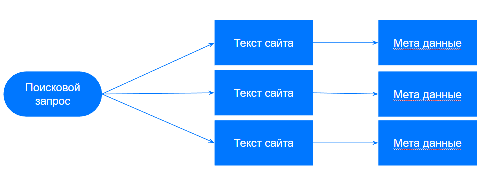

# Предобработка данных от заказчика

Полученный датасет от заказчика представлял из себя текста сайтов, очищенные от html разметки. 
Размер датасета 5 000 000 запросов

Рассмотрем структуру данных заказчика:

Структура данных очень похожа на структуру MS MARCO. Последующий анализ данных показал, что текста достаточно мусорные
и содержат как разметку сайта (заголовки, пункты меню, комментарии и т. д.) так и похабные запросы.
В связи с этим было принято решение произвести предобработку данных.

Для этого использовались следующие правила:
* Процентное соотношение русских слов в тексте (Порог 70%)
* Оценка модели Perplexity (Посоветовал Никита Ермолаев, спасибо ему за это!)
* Порог по длине токенов (< 1000 токенов)
* Порог по кол-ву букв (Брались текста длиной более 200 букв)

Также рассматривались еще правила:
* полный повтор запроса или расстояние левенштейна около 0
* кол-во уникальных слов / длине текста (< порога)
* максимальная длина слова (> порога)
* кол-во предложений (< порога)
* нет знаков препинания
* кол-во не буквенной информации (< порога)

Но так как нам нужно было сравнительно маленькое кол-во текстов 1000-2000. Правил из первого списка оказалось достаточно.

Так как часто статьи на сайтах оканчиваются комментариями было принято решение обрезать по ключевым словам : "Мне нравится:", "Комментарии:", "Оценивайте пожалуйста:", "Дата обращения:"

