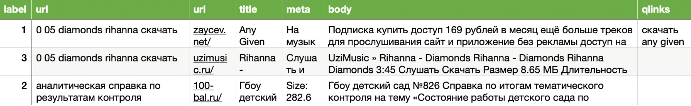

# Предобработка данных от заказчика

Полученный датасет от заказчика представлял из себя текста сайтов, очищенные от html разметки. 
Размер датасета 5 000 000 запросов

Рассмотрем структуру данных заказчика:

Структура данных очень похожа на структуру MS MARCO. Последующий анализ данных показал, что текста достаточно мусорные
и содержат как разметку сайта (заголовки, пункты меню, комментарии и т. д.) так и похабные запросы.
В связи с этим было принято решение произвести предобработку данных. Основываясь на данную статью [LIMA: Less Is More for Alignment](https://arxiv.org/abs/2305.11206), 1000-2000 хороших примеров д.б. достаточно для LLM. В итоге было создано 2 DS. Для обоих DS использовались следующие общие правила:
* Порог по длине токенов (< 1000 токенов)
* Порог по кол-ву букв (Брались текста длиной более 200 букв)
* Процентное соотношение русских слов в тексте (Порог 70%)

Теперь к отличиям двух DS:
1. DS очищенный от разметки, но не сильно разнообразный
⋅⋅* Тексты с сайта [КакПросто](https://www.kakprosto.ru)
⋅⋅* Парсинг текстов, чтобы исключить разметку сайтов. По ключевым словам : "Мне нравится:", "Комментарии:", "Оценивайте пожалуйста:", "Дата обращения:"
Сайт КакПросто был выбран, т.к. его было относительно легко парсить и все текста были хорошо написаны. Проблема в том, что на сайте КакПросто часто были написаны рецепты или инструкции к чему-либо, что привело к смещению домена.

2. DS с разметкой, но разнообразный
⋅⋅* Тексты с асессорской разметкой, где label=3
⋅⋅* Отбор текстов с использованием [CCNet: Extracting High Quality Monolingual Datasets from Web Crawl Data](https://arxiv.org/abs/1911.00359)
Данный подход дал более разнообразные тексты, но как минус в текстах осталась разметка, которую в последствии выучила модель.

Также рассматривались еще правила:
* полный повтор запроса или расстояние левенштейна около 0
* кол-во уникальных слов / длине текста (< порога)
* максимальная длина слова (> порога)
* кол-во предложений (< порога)
* нет знаков препинания
* кол-во не буквенной информации (< порога)
Но они не понадобились в финальной версии