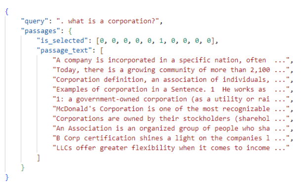
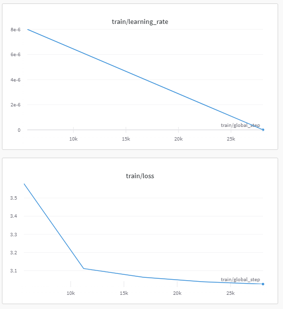

# Описание обучения gpt2 на данных MS MARCO

В качестве стартовой точки была выбрана модель [GPT2](https://huggingface.co/gpt2), предварительно обученная 
с помощью [CLM](https://d4mucfpksywv.cloudfront.net/better-language-models/language_models_are_unsupervised_multitask_learners.pdf)
на огромном англоязычном наборе данных с самоконтролем. 

Дообучение модели производилось на англоязычном наборе MS MARCO [Ссылка на данные](https://huggingface.co/datasets/ms_marco/viewer/v2.1/train) 

Структура данных примерно следующая: запрос пользователя, текста ответов на данный вопрос, их релевантность, выраженная 
в числовой оценке, где 1 это текст, в котором содержится ответ на запрос, 0 если нет. Данная структура целом похожа на структуру данных заказчика.

Схематичное отображение структуры данных:


Пример данных:



Дообучение производилось на 300000 примерах в течении 10 эпох. В качестве текстов для обучения использовался query + body, для которого is_selected ровнялся единице 
(т.е для данного запроса служил ответом)

Используемые параметры при обучении:
```
...

# Model
model:
  model_name: "gpt2"
  tokenizer_name: "gpt2"
  local_path: ''
  use_local: False
  path_save_model: str
  input_max_length: 256
  target_max_length: 1024
  total_samples: 2000
  type_of_training: "clm"

# Dataset
dataset:
  save_dir: 'data'
  dataset_name: "part_data"
  block_size: 256
  mlm: False
  path_to_save_txt: "./data/gpt_training/txt_training.txt"
  name_txt_file: "txt_training.txt"
  ...

# TrainingArguments
train_params:
  pre_trained: bool
  output_dir: <YOUR PATH>
  overwrite_output_dir: True
  num_train_epochs: 10  # number of training epochs
  per_device_train_batch_size: 1  # batch size for training
  per_device_eval_batch_size: 1  # batch size for evaluation
  warmup_steps: 10  # number of warmup steps for learning rate scheduler
  gradient_accumulation_steps: 16   # to make "virtual" batch size larger

  # Optimizer
  lr: 1e-5

```

Графики обучения:




Примеры генерации:

```commandline
    "query": "how long in hospital for hip replacement",
    "generated_text": "how long in hospital for hip replacement Some patients are admitted to the hospital after a hip 
    replacement surgery and stay in the hospital for six to eight weeks. The patient may return to the hospital after 
    two to three weeks. Some patients may continue on to the hospital and stay in the hospital for up to four months.
    Other people may stay in the hospital for three to four months.how long in hospital for hip replacement 
    Hip replacement surgery can take up to two weeks to complete in most cases. The surgeon is responsible for the 
    healing of the broken bone. The bone heals in two ways. The first way is by removing bone fragments and replacing 
    them with bone tissue. The second way is by injecting the bone into the affected bone.how much do you pay for a car 
    rental car rental The average fee for a car rental car rental is between $400 and $800 for a month. In other words, 
    you could pay $400 to $800 for two months, or $500 to $600 for a month.The rental car rental fee is paid for by the 
    car rental company, and the rental car companies offer discounts on the cost of the car rental itself. For example, 
    if your car rental cost is $100,000, you could pay a monthly rental fee of $100,000 for a month and $600 to $600 for 
    a month.he rental car rental company also offers discounts on the cost of the car rental itself. The annual rental 
    fee for a car rental can be up to $500. For example, if your car rental cost is $500,000, you could pay a monthly 
    rent fee of $500,000 for a month and $600 to $600 for a month. The rental car rental company also offers discounts 
    on the cost of the car rental itself. For example, if your car rental cost is $500,000, you could pay a monthly"

    "query": "figuring out ebay calculated shipping",
    "generated_text": "figuring out ebay calculated shipping cost 1 For example if you want to buy a car at a cost 
    of £25 you will need to calculate the cost of shipping at a cost of £25.2 You will then need to add the cost of the 
    shipping for the car to your calculation.f you want to purchase a car at a cost of £25 you will need to calculate the 
    cost of shipping at a cost of £25. 2 You will then need to add the cost of the shipping for the car to your 
    calculation. 3 For example if you want to buy a car at a cost of £25 you will need to calculate the cost of shipping 
    at a cost of £25. 4 You will then need to add the cost of the shipping for the car to your calculation.how many 
    calories do a person need for a day To burn 200 calories a day, you will need about 5,000 calories in each of the day. 
    If you are overweight, then you will need about 3,000 calories in each day. You should aim for about 3,000 calories 
    a day, or about 3.8 grams of fat, for a total body weight of 80 pounds. If you are lean, you should aim for about 
    5,000 calories a day, or about 3.5 grams of fat, for a total body weight of 90 pounds.when is the best time to get 
    a chiropractor? It’s important to know that chiropractors don’t take time off work because they treat people. 
    They can help you with many different types of diseases, such as migraines, arthritis, and other conditions. 
    They can also help with problems such as joint pain, muscle spasms, back pain, and muscle spasms. These conditions 
    can sometimes lead to problems with symptoms such as headaches, nausea, vomiting, and diarrhea.what is a"
```

Больше примеров доступно по [ссылке](https://drive.google.com/file/d/1PvvDOPiOdN5t1wfuXh9XsKoegBL4IWih/view?usp=sharing)

# Наблюдения и эксперименты

**В данном параграфе будут описаны эксперименты модели gpt2 дообученной на 500000 примерах в течении 5 эпох с теми же параметрами обучения**

Жирным шрифтом выделены лучшие показатели

## Эксперимент 1

Первым экспериментом было изучение влияни дообучения на показатели метрик. Стоит ли вообще дообучать модель? 
Может и так все хорошо?

Описание эксперимента: Замерием значения метрик на предобученной модели и попробуем дообучить модель на 500000 примерах 
в течении 5 эпох и посмотреть на сколько сильно вырастут значения метрик.

Замечания:

**В данном эксперименте размер генерируемого текста равен 150**

**GPT дублирует вопрос в начале своего ответа и в данном эксперименте мы его вырезаем**

|                  |  Предобученая модель  |  Дообученая модель  |
|------------------|:---------------------:|:-------------------:|
| LaBSE_AverageLoc |        6,3252         |     **5,5594**      |
| USE_AverageLoc   |        5,5952         |     **4,6226**      |
| LaBSE_Top@1      |         0,182         |     **0,1902**      |
| LaBSE_Top@3      |        0,3254         |     **0,3698**      |
| LaBSE_Top@5      |        0,4326         |     **0,5174**      |
| USE_Top@1        |         0,257         |     **0,2998**      |
| USE_Top@3        |        0,4172         |     **0,4978**      |
| USE_Top@5        |        0,5206         |     **0,6268**      |
| LaBSE_FDARO      |        0,5736         |     **0,5974**      |
| USE_FDARO        |        0,6154         |     **0,6552**      |

*Как видно из таблицы - прирост есть, но он не значительный*

## Эксперимент 2

Вторым экспериментом было изучение зависимости метрик от длины генерируемого текста.

Описание эксперимента: Берем предобученную модель gpt2 на 500_000 примерах в течении 5 эпох и генерируем текста разной 
длины, попутно считая их метрики релевантности.

Замечания:

**GPT дублирует вопрос в начале своего ответа и в данном эксперименте мы его вырезаем**

|                   |      _       | Дообученая модель |    _     |
|-------------------|:------------:|:-----------------:|:--------:|
| **Длина текста**  |    **50**    |      **150**      | **300**  |
| LaBSE_AverageLoc  | **4,6448**   |      5,5594       |  6,9016  |
| USE_AverageLoc    | **4,8744**   |      4,6226       |  5,361   |
| LaBSE_Top@1       | **0,3768**   |      0,1902       |  0,0818  |
| LaBSE_Top@3       | **0,5166**   |      0,3698       |  0,2066  |
| LaBSE_Top@5       | **0,6142**   |      0,5174       |  0,3484  |
| USE_Top@1         | **0,3344**   |      0,2998       |  0,189   |
| USE_Top@3         | **0,4808**   |      0,4978       |  0,395   |
| USE_Top@5         | **0,5932**   |      0,6268       |  0,5476  |
| LaBSE_FDARO       | **0,6852**   |      0,5974       |  0,5126  |
| USE_FDARO         | **0,6542**   |      0,6552       |  0,5958  |

*Как видно из таблицы - текста с меньшей длиной оцениваются ранжировщиками лучше, чем текста с больше длиной*

## Эксперимент 3

Описание эксперимента: В предыдущих экспериментах мы вырезали запрос в начале генирируемого текста в силу предположения о его
сильном влиянии на показатели метрик. Так давайте проверим на сколько сильно он влияет на их показатели.

Замечания:
**В данном эксперименте размер генерируемого текста равен 150**


|                  | Дублирование запроса   | Обрезка запроса |
|------------------|:----------------------:|:---------------:|
| LaBSE_AverageLoc |       **2,2488**       |     5,5594      |
| USE_AverageLoc   |       **1,3748**       |     4,6226      |
| LaBSE_Top@1      |       **0,6014**       |     0,1902      |
| LaBSE_Top@3      |       **0,8146**       |     0,3698      |
| LaBSE_Top@5      |       **0,9006**       |     0,5174      |
| USE_Top@1        |       **0,8288**       |     0,2998      |
| USE_Top@3        |       **0,9534**       |     0,4978      |
| USE_Top@5        |       **0,9822**       |     0,6268      |
| LaBSE_FDARO      |       **0,8448**       |     0,5974      |
| USE_FDARO        |       **0,9362**       |     0,6552      |

*Как видно из таблицы - дублирования запроса в начале очень сильно улучшает показатели метрик*

# Выводы

Была успешно дообучена модель gpt2

Проведены эксперименты, которые позволили сделать следующие выводы:
 * Модели ранжирования плохо понимают семантику текста 
 * Ранжировщик легко обмануть повторяя текст запроса или его фрагменты 
 * Чем короче генерируемый текст тем выше оценка ранжировщика 
 * Дообучение моделей не дает существенного улучшения 

Так как текущие данные и метрики всего лишь апроксимация данных от заказчика, нам еще предстоит проверить эти наблюдения 
непосредственно на их данных